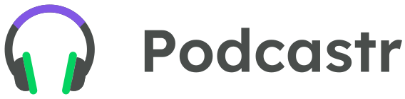
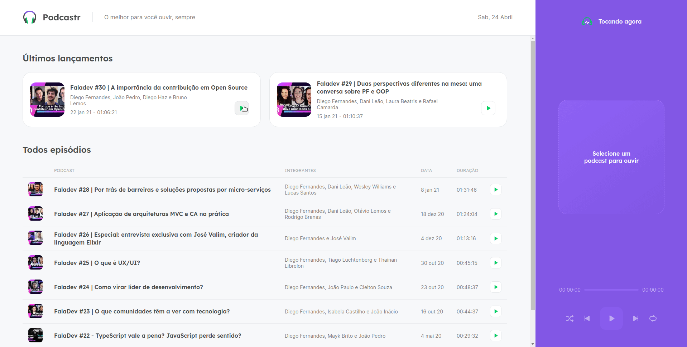
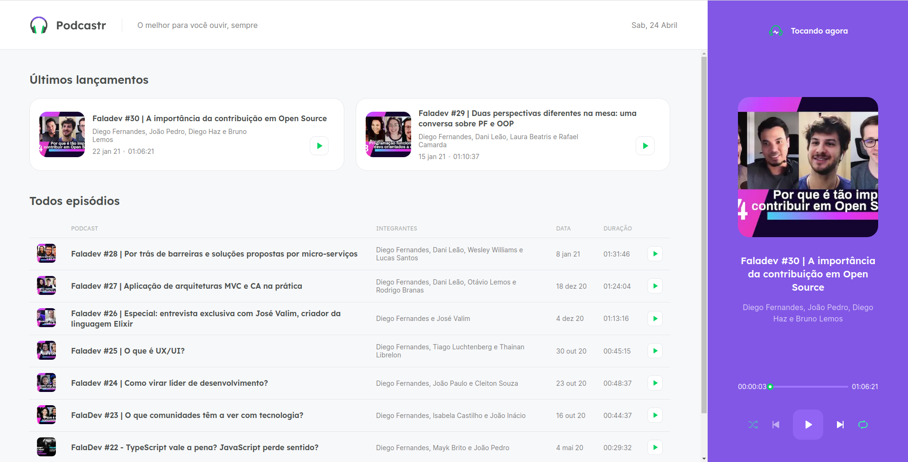

<h1 align="center">
  
</h1>
<p align="center">
  <a>
    
  </a>  
  <a>
    
  </a>
  <a>
    
  </a>
  <a href="https://lbesson.mit-license.org/" target="_blank">
    
  </a>
</p>

<h2 align="center"> 
 Podcastr 1.0 | Concluído 🚀 
</h2>

<p align="center">
 <a href="#-sobre-o-projeto">Sobre</a> •
 <a href="#-layout">Layout</a> • 
 <a href="#-como-executar-este-projeto">Como executar</a> • 
 <a href="#-tecnologias">Tecnologias</a> • 
 <a href="#-autor">Autor</a> • 
 <a href="#-licença">Licença</a>
</p>

## 💻 Sobre o projeto
O **Podcastr** é uma aplicação que tem como objetivo trazer podcasts do mundo da tecnologia.

Nesta aplicação o usuário pode ouvir um podcast inteiro apenas com um clique, ele pode ouvir vários também de forma incremental ou aleatória. Há também uma seção separada para descrever para cada episódio.

##### Projeto desenvolvido durante a **NLW#05 - Next Level Week - Trilha ReactJS** oferecida pela [Rocketseat](https://rocketseat.com.br/).

---
## 🎨 Layout
<a href="https://www.figma.com/file/lvj0X4V5flra1SQB83hHnz/Podcastr-(Copy)">
  
</a>

### Web

<p align="center">
  
</p>
 <br>
<p align="center">
  
  
</p>

---

## 🚀 Como executar este projeto 

### Pré-requisitos
Para executar esta aplicação, você deverá ter instalado em sua máquina as seguintes ferramentas:
* [Git](https://git-scm.com/)
* [Node.js](https://nodejs.org/en/)
* [NPM](https://www.npmjs.com/get-npm) ou [Yarn](https://yarnpkg.com/)

### 🎲 Rodando a aplicação web
```bash
# Clone este repositório -> usando SSH
$ git clone git@github.com:joaovitorJS/nlw-05-podcastr.git

# Acesse a pasta do projeto no seu terminal
$ cd nlw-05-podcastr

## Passos com yarn
# Instale as dependências
$ yarn install

# Executar o servidor JSON
$ yarn server

# Execute a aplicação em modo de desenvolvimento
$ yarn dev

## Passos com npm
# Instale as dependências
$ npm install

# Executar o servidor Json
$ npm run server

# Execute a aplicação em modo de desenvolvimento
$ npm run dev


#O servidor JSON estará rodando no porta 3333 - http://localhost:3333

# O servidor web inciará na porta:3000 - 
# acesse http://localhost:3000 em seu navegador para ver a aplicação funcionando
```

---

## 🛠 Tecnologias

* **[TypeScript](https://www.typescriptlang.org/)**
* **[ReactJS](https://pt-br.reactjs.org/)**
* **[NextJS](https://nextjs.org/)**
* **[JSON Server](https://www.npmjs.com/package/json-server)**
* **[Sass](https://sass-lang.com/install)**
* **[rc-slider](https://slider-react-component.vercel.app/)**

> Veja o arquivo  [package.json](https://github.com/joaovitorJS/nlw-04-moveit/blob/master/package.json) para ver todas as dependências do projeto

---

## 👨🏻‍💻 Autor
<br>
<p>
  
</p>

## **[João Vitor](https://github.com/joaovitorJS)**

#### Entre em contato

<p>
  <a href="https://www.instagram.com/jaovitooor/">
  
  </a>
  &nbsp;
  <a href="https://www.linkedin.com/in/jo%C3%A3o-vitor-oliveira-85a886174/" target="_blank">
  
  </a>
  &nbsp;
  <a href="mailto:rgm38342@comp.uems.br">
  
  </a>
</p>

---

## 📝 Licença
Este projeto esta sobe a licença [MIT](https://opensource.org/licenses/MIT).